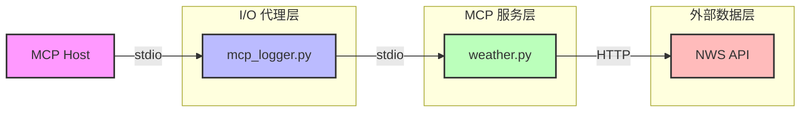
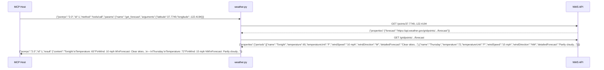
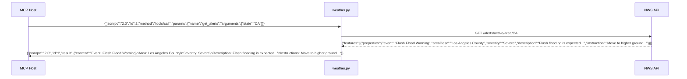

# Weather MCP Server

一个基于 FastMCP 的天气查询 MCP（Model Context Protocol）服务器，提供美国地区的天气预警和天气预报查询功能。

## 项目架构

### 组件说明

| 组件 | 文件名 | 作用 |
|------|--------|------|
| **MCP Server** | [weather.py](weather.py) | 核心服务，提供 `get_alerts` 和 `get_forecast` 两个工具 |
| **I/O 日志代理** | [mcp_logger.py](mcp_logger.py) | 透明代理，在 MCP Host 和 Server 之间转发流量并记录日志 |
| **日志文件** | [mcp_io.log](mcp_io.log) | 记录所有 stdin/stdout/stderr 交互内容 |

### MCP Host 与 MCP Server 交互流程



### 注册时序（Server → Host）

```mermaid
sequenceDiagram
    participant Host as MCP Host
    participant Server as weather.py

    Host->>Server: {"jsonrpc":"2.0","id":0,"method":"tools/list","params":{}}
    
    Server->>Host: {"jsonrpc":"2.0","id":0,"result":{"tools":[{"name":"get_alerts","description":"Get weather alerts for a US state.","parameters":{"type":"object","properties":{"state":{"type":"string","description":"Two-letter US state code (e.g. CA, NY)"}},"required":["state"]}},{"name":"get_forecast","description":"Get weather forecast for a location.","parameters":{"type":"object","properties":{"latitude":{"type":"number","description":"Latitude of the location"},"longitude":{"type":"number","description":"Longitude of the location"}},"required":["latitude","longitude"]}}]}}

    Host->>Server: {"jsonrpc":"2.0","id":-1,"method":"shutdown","params":{}}
    Server->>Host: {"jsonrpc":"2.0","id":-1,"result":null}
```



### 交互时序（get_forecast）



### 交互时序（get_alerts）



## 交互原理

### stdio 传输机制

MCP Server 使用 **stdio 传输模式**（`transport="stdio"`），这是 MCP 协议的标准交互方式：

1. **MCP Host** 通过标准输入（stdin）向服务器发送 JSON-RPC 格式的请求
2. **MCP Server** 通过标准输出（stdout）返回 JSON-RPC 格式的响应
3. 通信基于行分隔的 JSON 消息

### 日志代理机制

[mcp_logger.py](mcp_logger.py) 作为透明代理，实现了以下功能：

1. **进程包装**：通过 `subprocess.Popen` 启动实际的 MCP Server
2. **三路转发**：
   - **stdin 线程**：读取 Host 输入 → 记录日志 → 转发给 Server
   - **stdout 线程**：读取 Server 输出 → 记录日志 → 转发给 Host
   - **stderr 线程**：读取 Server 错误 → 记录日志 → 转发给 Host
3. **实时日志**：所有交互内容实时写入 [mcp_io.log](mcp_io.log)

## 安装

```bash
# 使用 uv 同步依赖
uv sync
```

## 使用

### 方式一：直接运行 MCP Server

```bash
uv run python weather.py
```

### 方式二：通过日志代理运行（推荐用于调试）

```bash
uv run python mcp_logger.py python weather.py
```

运行后查看日志文件：

```bash
tail -f mcp_io.log
```

## 可用工具

### 1. get_alerts

获取美国各州的天气预警信息。

**参数**：
- `state`: 美国州的两字母代码（如 CA、NY、TX）

**示例 MCP 请求**：
```json
{"jsonrpc":"2.0","id":1,"method":"tools/call","params":{"name":"get_alerts","arguments":{"state":"CA"}}}
```

**响应示例**：
```
Event: Flash Flood Warning
Area: Los Angeles County
Severity: Severe
Description: Flash flooding is expected...
Instructions: Move to higher ground immediately...
```

### 2. get_forecast

获取指定经纬度位置的天气预报。

**参数**：
- `latitude`: 纬度（如 37.7749）
- `longitude`: 经度（如 -122.4194）

**示例 MCP 请求**：
```json
{"jsonrpc":"2.0","id":2,"method":"tools/call","params":{"name":"get_forecast","arguments":{"latitude":37.7749,"longitude":-122.4194}}}
```

**响应示例**：
```
Tonight:
Temperature: 65°F
Wind: 10 mph W
Forecast: Clear skies with low temperatures...
---
Thursday:
Temperature: 72°F
Wind: 15 mph NW
Forecast: Partly cloudy with a chance of rain...
```

## 技术栈

- **Python** 3.14+
- **FastMCP** - MCP Server 框架
- **httpx** - HTTP 客户端（异步）
- **NWS API** - 美国国家气象局数据接口

## 依赖

项目依赖定义在 [pyproject.toml](pyproject.toml)：

- `mcp[cli]>=1.6.0`
- `httpx>=0.27.0`
